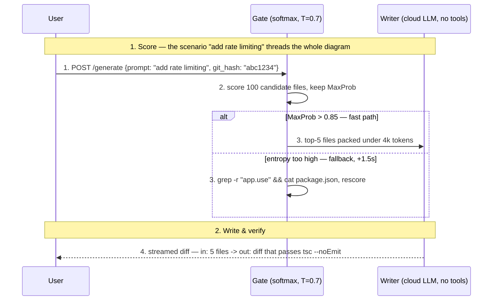
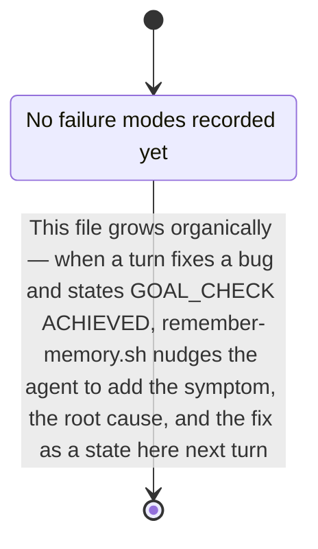

# AI Memory Init

Bootstraps `.ai-memory/` for the repo in the current working directory: a
`manifest.json` routing table plus a small set of Mermaid diagrams. The
delivery mechanism (`inject-memory.sh` on every prompt, `remember-memory.sh`
growing the diagrams over time) is already installed globally via
mohan-dotfiles and needs no per-repo setup — this skill only needs to produce
good starting content. See the `llm-memory` repo's `README.md` for the full
mechanism if you need it.

## The unit is a flow, not a folder

A diagram answers **"what happens when X"**, not "what lives in directory Y".
`request-lifecycle.mmd` beats `api.mmd`; `edit-guard-path.mmd` beats `hooks.mmd`.

Three reasons this is the right unit here:

- **Routing.** The matcher substring-matches the user's prompt text. People
  type "why did the edit get blocked", not "hooks". Verb-phrase keywords hit.
- **Growth.** `remember-memory.sh` nudges an append to the matched diagram.
  A flow has obvious insertion points (a new step, a new failure branch); an
  area bucket drifts into a junk drawer.
- **Sufficiency.** A flow with ordered steps tells the agent where new code
  goes. An inventory of names does not.

## 1. Guard against clobbering

- Repo root = `git rev-parse --show-toplevel` (fallback: cwd).
- If `.ai-memory/manifest.json` already exists, stop and ask the user whether
  to add missing flows only or leave it alone. Never silently overwrite an
  existing diagram — it may already hold learned history that
  `remember-memory.sh` appended over past sessions.

## 2. Survey the repo, then name the flows

- Read `.claude/repo-map.md` if present (see the `repo-map-check` skill)
  instead of re-deriving structure from scratch.
- Find the entry points: `main`/`index` files, route registrations, CLI
  command dispatch, hook or event registrations, job/queue consumers,
  build entry config. Each entry point is the head of one candidate flow.
- Trace 3-6 flows end to end, favouring the ones a person would actually ask
  about. Typical shapes:
  - **an inbound request** — arrives, is authenticated/validated, hits a
    handler, touches storage, returns
  - **a write path** — the sequence that mutates state, plus what guards it
  - **a build or startup path** — config read, wiring, what fails first when
    it fails
  - **a user-visible interaction** — event, state change, render
  - **the test path** — how a test finds and exercises the system
- Trace it in the actual code with Read/Grep. Never invent a step. If a
  candidate flow turns out to be two lines of glue, drop it rather than pad
  it into a diagram.

## 3. Drawing conventions

These are what make an injected diagram self-sufficient. The bar: a teammate
could re-implement the flow from the diagram alone, without opening the code.
Follow all of them, for starter diagrams and for any diagram generated later
on request.

- **Number the edges in flow order.** `A -->|1. reads stdin| B`. The order is
  the payload; an unlabeled arrow carries almost nothing.
- **Every edge carries the real call, every return edge the real shape.**
  Not "sends request" but the verbatim command, endpoint, signature, or
  payload sketch: `POST /messages (streaming=true)`,
  `grep -r "app.use" && cat package.json`,
  `POST /generate {prompt: "add rate limiting", git_hash: "abc1234"}`.
  Replies name what actually comes back (`return (FileList, AST_Graph)`,
  `Top-100 candidates`), never "returns data".
- **Anchor nodes to code, and name the mechanism in the node.** Real path in
  the label, line number when it is the decision point, and the "how" in
  parentheses: `Verifier (tsc --noEmit on the diff)` beats `Verifier`,
  `Guard[boilerplate-guard.sh:42 — blocks hand-written boilerplate by
  content signature]` beats `Guard`.
- **Say what a node decides, not just its name.** The label carries the
  explanation so the agent does not need a follow-up read.
- **Use simple English in every label.** Write labels a non-expert teammate
  could follow: short plain sentences, everyday words, no unexplained jargon
  or acronyms. If a technical term is unavoidable (a real file, function, or
  protocol name), keep the term but explain what it does in plain words right
  next to it, e.g. `Router[ai_memory_match_route — picks ONE diagram file by
  comparing the prompt text to each route's keyword list]`.
- **Give an input example and an output example for every stage/block —
  every one, not just the heavyweight few.** This is the single most
  commonly dropped convention, because it is tempting to write the `in ->
  out` example only on the 2-3 nodes that get a deep-dive note and leave
  the rest as bare mechanism descriptions. Don't: a reader scanning the main
  flow should see a concrete value transform at every single node without
  having to jump to a note. Each node's own label states a concrete example
  of what goes in and what comes out, not just the transformation's name —
  the deep-dive note (in/mechanism/cost/out) is an ADDITION for the 2-3
  heaviest nodes, never a substitute for the plain node-level example.
  Prefer real values traced from the actual code/logs over invented ones;
  where a live example isn't available, thread one concrete, plausible
  scenario through the whole diagram (the same input prompt, file, or
  request reused at every node) and mark illustrative values with `e.g.`
  rather than presenting them as measured. Format: `Node[what it does — in:
  <example input> -> out: <example output>]`, e.g. `Parse["splits the
  prompt into words — in: #quot;why was my edit blocked#quot; -> out: 5
  words"]`. For a decision/branch node, give one example per branch (the
  input that takes each path, and that path's output). Skip this only for a
  pure pass-through node that changes nothing (e.g. a plain socket/queue
  hop).
- **Draw every branch to its end, unhappy ones included.** Each decision
  becomes an `alt`/branch pair whose guard states the condition with its
  threshold — `[MaxProb > 0.85 — fast path]` vs `[entropy too high —
  fallback, +1.5s]` — and the failure/repair side gets real steps to its
  conclusion, never a "handles errors" stub. Use `loop`/`par`/`opt` frames
  wherever iteration or concurrency actually exists.
- **Quantify with traced numbers.** Where code, config, or logs give a
  number, put it in the label or a note: latency, token budget, retry count,
  threshold, default (`<500ms`, `under 4k tokens`, `T=0.7`, `rank=16`). Never
  invent a number — an untraceable number is worse than none.
- **Track the data shape between every stage.** Each edge states the form of
  what flows, not just its name: exact JSON keys, file path, matrix shape,
  env var (`state_dir/goal.txt — one line of text`,
  `[1000 x 4096] -> [1000 x 14336]`). When a stage transforms the shape, the
  label shows in-shape and out-shape.
- **Thread one concrete scenario end to end.** Pick one realistic input and
  reuse it in every payload and example from first request to final output,
  so the diagram doubles as a worked example. Where a stage is a computation,
  show the actual arithmetic on a tiny input (3-4 elements computed for
  real), not only the formula:
  `softmax([-0.49, 0.75, 0.39]) -> [0.15, 0.50, 0.35], rows sum to 1.0`.
- **Call out misconceptions with a NOT.** When the obvious assumption about a
  stage is wrong, say so explicitly in the label or a note: `Stop stdout
  NEVER reaches the model`, `NOT tied weights`, `mask runs in prefill AND
  decode`. These lines prevent the most expensive class of repeated mistake.
- **Keep corrections visible when a diagram grows.** When a later session
  finds an inaccuracy in an existing diagram, fix the wrong label AND leave a
  `CORRECTION:` note saying what was wrong and why, so the misconception is
  not silently relearned from memory of the old version.
- **Give heavyweight stages a deep-dive note with a fixed shape.** For the
  2-3 stages that carry the most machinery, attach a note in this order:
  in (source + shape), mechanism (formula or code path), cost (latency or
  size, only if traced), out (destination + shape). Same template every
  time, so grown diagrams stay uniform.
- **Split long sequences into numbered phases.** A `Note over` divider per
  phase: `1. Initial request`, `2. Context loop`, `3. Verify & repair`.
- **Match the diagram type to the shape.** `sequenceDiagram` for a lifecycle
  with participants passing control, `flowchart` for layering and branch
  logic, `stateDiagram-v2` for a failure-mode catalog, `classDiagram` only
  when methods genuinely matter.
- **Cap size, not density.** Flowcharts: 10-30 nodes. Sequences: at most 12
  participants and about 40 messages. The matched file is inlined verbatim
  into every matching prompt, so the density lives in labels, edge text, and
  notes, never in element count. Split a bloated flow into two flows instead
  of growing it. If the simple-English explanation plus the input/output
  example makes a label too long for the node shape, move the example into a
  `note` attached to that node rather than dropping it.

Target density, all conventions in one snippet:



## 4. Always write the overview

`.ai-memory/diagrams/overview/system.mmd` — the one-screen god map: the major
layers or subsystems, the direction data moves between them, and where each
detailed flow plugs in. Keep it under 20 nodes.

`inject-memory.sh` injects exactly one file per prompt (highest priority
match wins), so the overview must earn its own route rather than ride along
with a deep dive. Give it broad orientation keywords ("architecture",
"overview", "how does this work", "structure", plus the repo's own name) and
`priority: 10`.

## 5. Always seed the debug playbook

`.ai-memory/diagrams/debug/playbook.mmd` is always created, as a failure-mode
state machine rather than a flowchart, so learned symptoms append as states:



Each learned entry should become a state named for the **symptom** (what the
user sees), with the transition label carrying root cause and fix. Symptom
naming matters: that is the text the router matches against. Write the
symptom and the root-cause/fix in simple English, and where possible phrase
the fix as an input/output example: the command or input that reproduced the
bug, and the output after the fix, e.g. `BadRoute --> Fixed: in: prompt
"why blocked" matched 0 routes -> out: added keyword "why blocked" to
edit-guard-path route, now matches it`.

## 6. Write the manifest

`.ai-memory/manifest.json`, one route per diagram actually generated:

```json
{
  "routes": [
    { "keywords": ["...", "..."], "file": "diagrams/<flow>/<name>.mmd", "priority": 8 }
  ]
}
```

- `keywords`: 4-8 entries per route. Include the **verb phrases** someone
  would type ("prompt gets injected", "why was my edit blocked") alongside the
  real symbols, file names, and identifiers found in step 2. Matching is
  case-insensitive substring, so prefer distinctive multi-word phrases over
  single common words that will over-match.
- Check for collisions across routes before writing. A keyword that appears
  in two routes hands the prompt to whichever has the higher priority, which
  silently starves the other one.
- `priority`: overview 10, debug playbook 9, remaining flows 5-8 by how
  central they are to this specific repo.

## 7. Housekeeping

- Create `.ai-memory/updates/.gitkeep` (reserved for future incremental logs,
  matches the layout in the `llm-memory` repo).
- Report a short summary: which flows were created and why, which candidates
  were dropped and why, and remind the user these diagrams are living
  documents — `remember-memory.sh` grows them, and manual edits are always
  welcome.

## Non-goals

- Does not touch `.claude/settings.json`, hooks, or any tool config — the
  hooks that read `.ai-memory/` are already installed globally by
  mohan-dotfiles and work in any repo the moment `manifest.json` exists.
- Does not commit anything.
