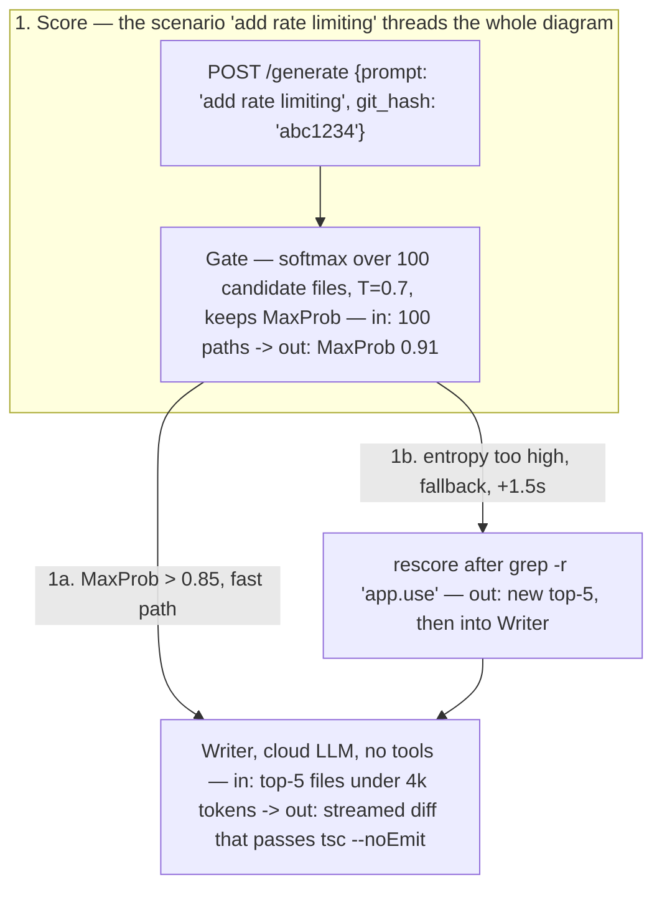
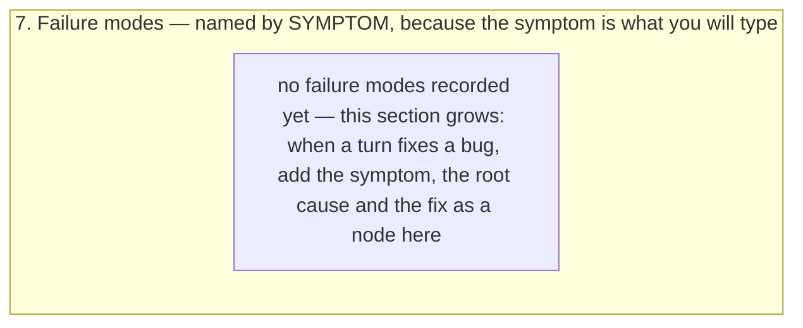

# AI Memory Init

Bootstraps `.ai-memory/` for the repo in the current working directory: a
`manifest.json` plus **exactly one** Mermaid diagram,
`.ai-memory/diagrams/system.mmd`. The delivery mechanism
(`inject-memory.sh` on every prompt) is already installed globally via
mohan-dotfiles and needs no per-repo setup — this skill only needs to produce
good starting content. See the `llm-memory` repo's `README.md` for the full
mechanism if you need it.

## One diagram per repo

`.ai-memory/diagrams/system.mmd` is the whole memory. Never create a second
`.mmd`. Everything learned later is added **into** this file: a new node, a new
branch, a new failure-mode line.

Why one file:

- **No routing to get wrong.** With a `"diagram"` key in the manifest,
  `inject-memory.sh` injects this file on *every* prompt. Nothing is starved by
  a keyword that failed to match or by a higher-priority route.
- **Growth has one address.** Any new fact has exactly one place to go, so the
  memory cannot fragment into diagrams that disagree with each other.
- **It is injected every turn.** That is the cost, and it is what keeps the
  file honest: a wrong or bloated label is paid for on every prompt, so
  correctness and compression both matter more than coverage.

## The section unit is a flow, not a folder

Inside the one diagram, each `subgraph` answers **"what happens when X"**, not
"what lives in directory Y". A "request lifecycle" section beats an "api"
section; an "edit guard path" section beats a "hooks" section. A flow with
ordered steps tells the agent where new code goes; an inventory of names does
not.

## 1. Guard against clobbering

- Repo root = `git rev-parse --show-toplevel` (fallback: cwd).
- If `.ai-memory/manifest.json` already exists, stop and ask the user whether
  to add missing sections only or leave it alone. Never overwrite the existing
  diagram wholesale — it holds learned history appended over past sessions.
- If the repo still has the old multi-file layout (several `.mmd` files, a
  `routes` array), offer to merge them into one `system.mmd` and switch the
  manifest to `{"diagram": "diagrams/system.mmd"}`.

## 2. Survey the repo, then name the sections

- Read `.claude/repo-map.md` if present (see the `repo-map-check` skill)
  instead of re-deriving structure from scratch.
- Find the entry points: `main`/`index` files, route registrations, CLI
  command dispatch, hook or event registrations, job/queue consumers,
  build entry config. Each entry point is the head of one candidate flow.
- Trace 3-6 flows end to end, favouring the ones a person would actually ask
  about. Each becomes one `subgraph` section of `system.mmd`. Typical shapes:
  - **an inbound request** — arrives, is authenticated/validated, hits a
    handler, touches storage, returns
  - **a write path** — the sequence that mutates state, plus what guards it
  - **a build or startup path** — config read, wiring, what fails first when
    it fails
  - **a user-visible interaction** — event, state change, render
  - **the test path** — how a test finds and exercises the system
- Trace it in the actual code with Read/Grep. Never invent a step. If a
  candidate flow turns out to be two lines of glue, drop it rather than pad
  it into a section.

## 3. Drawing conventions

These are what make the injected diagram self-sufficient. The bar: a teammate
could re-implement any flow from the diagram alone, without opening the code.
Follow all of them, for the starter file and for every later expansion of it.

- **Number the edges in flow order.** `A -->|1. reads stdin| B`. The order is
  the payload; an unlabeled arrow carries almost nothing.
- **Every edge carries the real call, every return edge the real shape.**
  Not "sends request" but the verbatim command, endpoint, signature, or
  payload sketch: `POST /messages (streaming=true)`,
  `grep -r "app.use" && cat package.json`,
  `POST /generate {prompt: "add rate limiting", git_hash: "abc1234"}`.
  Replies name what actually comes back (`return (FileList, AST_Graph)`,
  `Top-100 candidates`), never "returns data".
- **Anchor nodes to code, and name the mechanism in the node.** Real path in
  the label, line number when it is the decision point, and the "how" in
  parentheses: `Verifier (tsc --noEmit on the diff)` beats `Verifier`,
  `Guard[secret-guard.sh:42 — blocks a tool call whose input looks like a
  live secret]` beats `Guard`.
- **Say what a node decides, not just its name.** The label carries the
  explanation so the agent does not need a follow-up read.
- **Use simple English in every label.** Write labels a non-expert teammate
  could follow: short plain sentences, everyday words, no unexplained jargon
  or acronyms. If a technical term is unavoidable (a real file, function, or
  protocol name), keep the term but explain what it does in plain words right
  next to it, e.g. `Router[ai_memory_match_route — picks ONE diagram file by
  comparing the prompt text to each route's keyword list]`.
- **Give an input example and an output example for every stage/block —
  every one, not just the heavyweight few.** This is the single most
  commonly dropped convention, because it is tempting to write the `in ->
  out` example only on the 2-3 nodes that get a deep-dive note and leave
  the rest as bare mechanism descriptions. Don't: a reader scanning the main
  flow should see a concrete value transform at every single node without
  having to jump to a note. Each node's own label states a concrete example
  of what goes in and what comes out, not just the transformation's name —
  the deep-dive note (in/mechanism/cost/out) is an ADDITION for the 2-3
  heaviest nodes, never a substitute for the plain node-level example.
  Prefer real values traced from the actual code/logs over invented ones;
  where a live example isn't available, thread one concrete, plausible
  scenario through the whole diagram (the same input prompt, file, or
  request reused at every node) and mark illustrative values with `e.g.`
  rather than presenting them as measured. Format: `Node[what it does — in:
  <example input> -> out: <example output>]`, e.g. `Parse["splits the
  prompt into words — in: #quot;why was my edit blocked#quot; -> out: 5
  words"]`. For a decision/branch node, give one example per branch (the
  input that takes each path, and that path's output). Skip this only for a
  pure pass-through node that changes nothing (e.g. a plain socket/queue
  hop).
- **Draw every branch to its end, unhappy ones included.** Each decision
  becomes an `alt`/branch pair whose guard states the condition with its
  threshold — `[MaxProb > 0.85 — fast path]` vs `[entropy too high —
  fallback, +1.5s]` — and the failure/repair side gets real steps to its
  conclusion, never a "handles errors" stub. Use `loop`/`par`/`opt` frames
  wherever iteration or concurrency actually exists.
- **Quantify with traced numbers.** Where code, config, or logs give a
  number, put it in the label or a note: latency, token budget, retry count,
  threshold, default (`<500ms`, `under 4k tokens`, `T=0.7`, `rank=16`). Never
  invent a number — an untraceable number is worse than none.
- **Track the data shape between every stage.** Each edge states the form of
  what flows, not just its name: exact JSON keys, file path, matrix shape,
  env var (`state_dir/goal.txt — one line of text`,
  `[1000 x 4096] -> [1000 x 14336]`). When a stage transforms the shape, the
  label shows in-shape and out-shape.
- **Thread one concrete scenario end to end.** Pick one realistic input and
  reuse it in every payload and example from first request to final output,
  so the diagram doubles as a worked example. Where a stage is a computation,
  show the actual arithmetic on a tiny input (3-4 elements computed for
  real), not only the formula:
  `softmax([-0.49, 0.75, 0.39]) -> [0.15, 0.50, 0.35], rows sum to 1.0`.
- **Call out misconceptions with a NOT.** When the obvious assumption about a
  stage is wrong, say so explicitly in the label or a note: `Stop stdout
  NEVER reaches the model`, `NOT tied weights`, `mask runs in prefill AND
  decode`. These lines prevent the most expensive class of repeated mistake.
- **Keep corrections visible when a diagram grows.** When a later session
  finds an inaccuracy in an existing diagram, fix the wrong label AND leave a
  `CORRECTION:` note saying what was wrong and why, so the misconception is
  not silently relearned from memory of the old version.
- **Give heavyweight stages a deep-dive note with a fixed shape.** For the
  2-3 stages that carry the most machinery, attach a note in this order:
  in (source + shape), mechanism (formula or code path), cost (latency or
  size, only if traced), out (destination + shape). Same template every
  time, so grown diagrams stay uniform.
- **Split long sequences into numbered phases.** A `Note over` divider per
  phase: `1. Initial request`, `2. Context loop`, `3. Verify & repair`.
- **`flowchart` is the type.** One file means one diagram type, and only
  `flowchart` expresses every shape: a lifecycle becomes a numbered chain, a
  failure-mode catalog becomes a subgraph of symptom nodes. Do not reach for
  `sequenceDiagram` or `stateDiagram-v2` — they cannot coexist here.
- **One `subgraph` per flow, numbered in the title.** `subgraph P3["3. Tool
  call gauntlet — ..."]`. Cross-section edges are how the flows connect; draw
  them rather than repeating a node in two sections.
- **Cap the file, not the sections.** Aim for roughly 150 lines / 50 nodes for
  the whole file. It is inlined verbatim into *every* prompt, so the density
  lives in labels, edge text, and notes. When it gets too big, compress
  labels and delete what turned out not to matter — never split it into a
  second file.

Target density, all conventions in one snippet:



## 4. Open with the orientation section

Section 1 of `system.mmd` is the one-screen god map: the major layers or
subsystems, the direction data moves between them, and where each later
section plugs in. Keep it under 10 nodes — the detail lives in the sections
below it, and every reader passes through this one first.

## 5. Always end with the failure-mode section

The last `subgraph` is the debug playbook. Each entry is one node named for
the **symptom** (what the user sees), with root cause and fix in the same
label:



Write symptom, root cause and fix in simple English, and where possible phrase
the fix as an input/output example: the command that reproduced the bug, and
the output after the fix.

## 6. Write the manifest

`.ai-memory/manifest.json` names the one diagram — that is the whole file:

```json
{
  "diagram": "diagrams/system.mmd"
}
```

`ai_memory_match_route` (in `claude/hooks/lib/common.sh`) returns that path for
every prompt, with no keyword matching. The older `{"routes": [...]}` schema
with keywords and priorities is still honoured for repos that have not
migrated, but do not write a new one.

## 7. Housekeeping

- Create `.ai-memory/updates/.gitkeep` (reserved for future incremental logs,
  matches the layout in the `llm-memory` repo).
- Report a short summary: which sections were created and why, which
  candidates were dropped and why, and remind the user the diagram is a living
  document — later sessions expand this same file, and manual edits are always
  welcome.

## Non-goals

- Does not touch `.claude/settings.json`, hooks, or any tool config — the
  hooks that read `.ai-memory/` are already installed globally by
  mohan-dotfiles and work in any repo the moment `manifest.json` exists.
- Does not commit anything.
