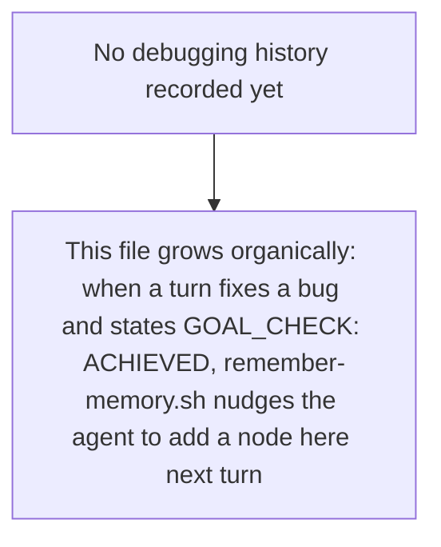

# AI Memory Init

Bootstraps `.ai-memory/` for the repo in the current working directory: a
`manifest.json` routing table plus one starter Mermaid diagram per area of
the codebase that's actually present. The delivery mechanism (`inject-memory.sh`
on every prompt, `remember-memory.sh` growing the diagrams over time) is
already installed globally via mohan-dotfiles and needs no per-repo setup —
this skill only needs to produce good starting content. See the `llm-memory`
repo's `README.md` for the full mechanism if you need it.

## 1. Guard against clobbering

- Repo root = `git rev-parse --show-toplevel` (fallback: cwd).
- If `.ai-memory/manifest.json` already exists, stop and ask the user whether
  to add missing categories only or leave it alone. Never silently overwrite
  an existing diagram — it may already hold learned history that
  `remember-memory.sh` appended over past sessions.

## 2. Survey the repo

- Read `.claude/repo-map.md` if present (see the `repo-map-check` skill)
  instead of re-deriving structure from scratch.
- Classify which of these areas genuinely exist here — skip any that don't
  apply, never fabricate a diagram for something absent:
  - **api** — server routes/endpoints/controllers (`rg` for router
    registration, `@app.route`, Express `Router()`, `[Http*]` attributes,
    gRPC service defs, ...)
  - **ui** — frontend components/pages (`.tsx`/`.jsx`/`.vue`/`.svelte`,
    a `components/` or `pages/` dir)
  - **debug** — always created regardless of what else is found (step 4)
  - **test** — the test suite's shape (pytest/jest/go test/bazel target
    layout), not individual test cases
  - **refactor** — only when there's a real service/module dependency graph
    worth mapping; skip for small or single-module repos
  - anything else the repo obviously calls for (e.g. **cli**, **infra**,
    **schema**) if none of the above fit but something concrete does —
    don't force a bad category just to fill a slot

## 3. Generate one diagram per area found

For each area with real content, write `.ai-memory/diagrams/<area>/<name>.mmd`:

- Base it on what is ACTUALLY in the repo — real route paths, real component
  names, real module/service names pulled via Read/Grep — never placeholder
  or invented content.
- Pick the Mermaid diagram type that fits the shape of the thing: `flowchart`
  for call/dependency graphs, `mindmap` for a tree of endpoints or
  components, `classDiagram` for services with methods.
- Keep each diagram small, 10-30 nodes: a starting skeleton for
  `remember-memory.sh` to grow over time, not an exhaustive dump of the
  entire codebase.

## 4. Always seed the debug playbook

`.ai-memory/diagrams/debug/playbook.mmd` is always created, even with no
history yet:



## 5. Write the manifest

`.ai-memory/manifest.json`, one route per diagram actually generated:

```json
{
  "routes": [
    { "keywords": ["...", "..."], "file": "diagrams/<area>/<name>.mmd", "priority": 9 }
  ]
}
```

- `keywords`: 3-6 words/phrases someone would actually type when working in
  that area — include real symbol or route names found in step 3, not just
  the generic category word.
- `priority`: 1-10, higher for areas more central to this specific repo; the
  debug playbook defaults to 9.

## 6. Housekeeping

- Create `.ai-memory/updates/.gitkeep` (reserved for future incremental logs,
  matches the layout in the `llm-memory` repo).
- Report a short summary: which areas were created and why, which were
  skipped and why, and remind the user these diagrams are living documents —
  `remember-memory.sh` grows them, and manual edits are always welcome.

## Non-goals

- Does not touch `.claude/settings.json`, hooks, or any tool config — the
  hooks that read `.ai-memory/` are already installed globally by
  mohan-dotfiles and work in any repo the moment `manifest.json` exists.
- Does not commit anything.
