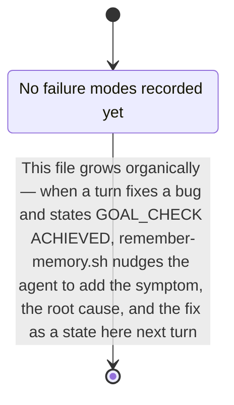

# AI Memory Init

Bootstraps `.ai-memory/` for the repo in the current working directory: a
`manifest.json` routing table plus a small set of Mermaid diagrams. The
delivery mechanism (`inject-memory.sh` on every prompt, `remember-memory.sh`
growing the diagrams over time) is already installed globally via
mohan-dotfiles and needs no per-repo setup — this skill only needs to produce
good starting content. See the `llm-memory` repo's `README.md` for the full
mechanism if you need it.

## The unit is a flow, not a folder

A diagram answers **"what happens when X"**, not "what lives in directory Y".
`request-lifecycle.mmd` beats `api.mmd`; `edit-guard-path.mmd` beats `hooks.mmd`.

Three reasons this is the right unit here:

- **Routing.** The matcher substring-matches the user's prompt text. People
  type "why did the edit get blocked", not "hooks". Verb-phrase keywords hit.
- **Growth.** `remember-memory.sh` nudges an append to the matched diagram.
  A flow has obvious insertion points (a new step, a new failure branch); an
  area bucket drifts into a junk drawer.
- **Sufficiency.** A flow with ordered steps tells the agent where new code
  goes. An inventory of names does not.

## 1. Guard against clobbering

- Repo root = `git rev-parse --show-toplevel` (fallback: cwd).
- If `.ai-memory/manifest.json` already exists, stop and ask the user whether
  to add missing flows only or leave it alone. Never silently overwrite an
  existing diagram — it may already hold learned history that
  `remember-memory.sh` appended over past sessions.

## 2. Survey the repo, then name the flows

- Read `.claude/repo-map.md` if present (see the `repo-map-check` skill)
  instead of re-deriving structure from scratch.
- Find the entry points: `main`/`index` files, route registrations, CLI
  command dispatch, hook or event registrations, job/queue consumers,
  build entry config. Each entry point is the head of one candidate flow.
- Trace 3-6 flows end to end, favouring the ones a person would actually ask
  about. Typical shapes:
  - **an inbound request** — arrives, is authenticated/validated, hits a
    handler, touches storage, returns
  - **a write path** — the sequence that mutates state, plus what guards it
  - **a build or startup path** — config read, wiring, what fails first when
    it fails
  - **a user-visible interaction** — event, state change, render
  - **the test path** — how a test finds and exercises the system
- Trace it in the actual code with Read/Grep. Never invent a step. If a
  candidate flow turns out to be two lines of glue, drop it rather than pad
  it into a diagram.

## 3. Drawing conventions

These are what make an injected diagram self-sufficient. Follow all five.

- **Number the edges in flow order.** `A -->|1. reads stdin| B`. The order is
  the payload; an unlabeled arrow carries almost nothing.
- **Anchor nodes to code.** Put the real path in the label, and a line number
  when it is the decision point: `Guard[boilerplate-guard.sh:42 — blocks
  hand-written boilerplate by content signature]`.
- **Say what a node decides, not just its name.** The label carries the
  explanation so the agent does not need a follow-up read.
- **Match the diagram type to the shape.** `sequenceDiagram` for a lifecycle
  with participants passing control, `flowchart` for layering and branch
  logic, `stateDiagram-v2` for a failure-mode catalog, `classDiagram` only
  when methods genuinely matter.
- **Cap at 10-30 nodes.** The matched file is inlined verbatim into every
  matching prompt, so the density lives in labels and edge text, never in
  node count. Split a bloated flow into two flows instead of growing it.

## 4. Always write the overview

`.ai-memory/diagrams/overview/system.mmd` — the one-screen god map: the major
layers or subsystems, the direction data moves between them, and where each
detailed flow plugs in. Keep it under 20 nodes.

`inject-memory.sh` injects exactly one file per prompt (highest priority
match wins), so the overview must earn its own route rather than ride along
with a deep dive. Give it broad orientation keywords ("architecture",
"overview", "how does this work", "structure", plus the repo's own name) and
`priority: 10`.

## 5. Always seed the debug playbook

`.ai-memory/diagrams/debug/playbook.mmd` is always created, as a failure-mode
state machine rather than a flowchart, so learned symptoms append as states:



Each learned entry should become a state named for the **symptom** (what the
user sees), with the transition label carrying root cause and fix. Symptom
naming matters: that is the text the router matches against.

## 6. Write the manifest

`.ai-memory/manifest.json`, one route per diagram actually generated:

```json
{
  "routes": [
    { "keywords": ["...", "..."], "file": "diagrams/<flow>/<name>.mmd", "priority": 8 }
  ]
}
```

- `keywords`: 4-8 entries per route. Include the **verb phrases** someone
  would type ("prompt gets injected", "why was my edit blocked") alongside the
  real symbols, file names, and identifiers found in step 2. Matching is
  case-insensitive substring, so prefer distinctive multi-word phrases over
  single common words that will over-match.
- Check for collisions across routes before writing. A keyword that appears
  in two routes hands the prompt to whichever has the higher priority, which
  silently starves the other one.
- `priority`: overview 10, debug playbook 9, remaining flows 5-8 by how
  central they are to this specific repo.

## 7. Housekeeping

- Create `.ai-memory/updates/.gitkeep` (reserved for future incremental logs,
  matches the layout in the `llm-memory` repo).
- Report a short summary: which flows were created and why, which candidates
  were dropped and why, and remind the user these diagrams are living
  documents — `remember-memory.sh` grows them, and manual edits are always
  welcome.

## Non-goals

- Does not touch `.claude/settings.json`, hooks, or any tool config — the
  hooks that read `.ai-memory/` are already installed globally by
  mohan-dotfiles and work in any repo the moment `manifest.json` exists.
- Does not commit anything.
